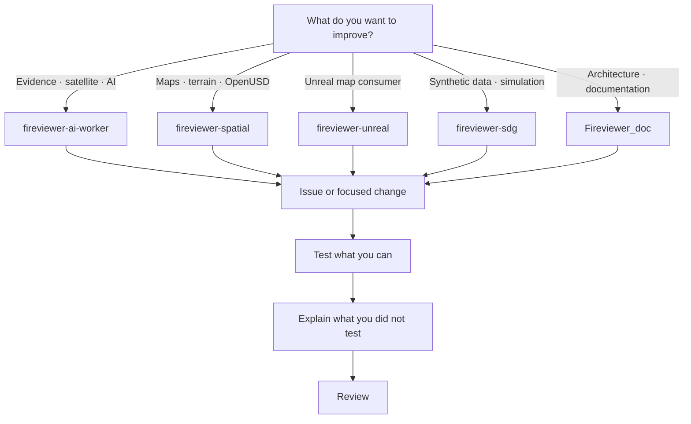

# Contributing to FireViewer

FireViewer is large enough now that I cannot realistically improve every part
at the same speed.

Contributions are welcome, including small ones.

A useful contribution does not have to be a new model or a large feature.

Fixing a confusing explanation, testing a Map Builder package on another
machine, finding an OpenUSD compatibility problem, checking a dataset,
improving accessibility, reproducing a geographic edge case or showing that
one of my assumptions is wrong can all be valuable.

You do not need to arrive with a complete solution.

**A well-documented issue showing that something does not work is already
useful.**

## Where things live

The main public repositories are:

- `Fireviewer_doc`
- `fireviewer-ai-worker`
- `fireviewer-spatial`
- `fireviewer-unreal`
- `fireviewer-sdg`

Models, datasets, measured maps and other hosted research artifacts are
published through the FireViewer Hugging Face organisation.

## Areas where help would genuinely be useful

Today, useful areas include:

- OpenUSD assets, packaging and interoperability;
- geospatial validation and reproducibility;
- satellite and historical-data handling;
- model and dataset evaluation;
- accessibility and incident exploration;
- testing on different environments;
- documentation that makes the system easier to understand without hiding its
  limitations.

This list is not exclusive.

## Before writing a lot of code

For a small obvious fix, a focused pull request is usually enough.

For something that changes architecture, evidence semantics or public
contracts, opening an issue first is useful.

This matters especially for changes involving:

- what counts as evidence;
- geographic coordinates or uncertainty;
- Part.4 reconstruction;
- review or publication;
- data retention;
- licensing;
- real/synthetic separation;
- existing OpenUSD package compatibility.

## Things FireViewer should not silently do

Some rules matter more than implementation convenience:

- a detector result does not become a GPS coordinate;
- a model output does not overwrite source evidence;
- uncertainty does not disappear because it is inconvenient;
- synthetic material does not become real-event evidence;
- historical evidence must respect when it was actually available;
- unknown information should remain unknown;
- a viewer derivative does not replace the authoritative artifact.

If a contribution intentionally changes one of these assumptions, that is an
architecture discussion rather than a normal implementation detail.

## Historical evidence

Retrospective reconstruction has an additional constraint: time.

A satellite product or archive entry that can be discovered today cannot
automatically be treated as information that existed at the historical state
being reconstructed.

Acquisition time, publication or availability time, retrieval time and the
FireViewer state cutoff are different concepts.

When those dates are unknown, that uncertainty should stay visible.

## Data and rights

Please do not commit:

- credentials or tokens;
- private incident evidence;
- personal information;
- private infrastructure identifiers;
- copyrighted media without appropriate redistribution rights;
- raw third-party content merely because it is publicly accessible.

Git repositories are source-only publication surfaces. Do not commit datasets,
model weights or checkpoints, imported 3D content libraries, generated map
packages, reproduction outputs, renders, captures, caches or build products.
Small fixtures must be synthetic and non-personal; the Unreal repository keeps
one invented JSON/GeoJSON incident configuration example for its public
contract.

When contributing a dataset, model, map or asset, preserving its origin,
licence and relevant transformations is part of the contribution.

## Tests

There is no single FireViewer development command because the repositories do
different jobs.

Use the README and test commands of the repository you are modifying.

A successful unit test does not automatically mean:

- cloud deployment works;
- a GPU path is qualified;
- a model is scientifically validated;
- a reconstruction is accurate on real incidents;
- a feature is ready for unattended publication.

Please describe what you actually tested.

## Pull requests

A useful PR should make it possible to understand:

- what was wrong or missing;
- what changed;
- how you tested it;
- what you did not test;
- whether contracts, data, models, assets or licences are affected.

It does not need to be a long report.

## Documentation

If code changes what FireViewer publicly claims to do, documentation should
change with it.

Please do not silently turn:

`implemented`

into:

`validated`

or:

`available`

into:

`operational`

without evidence.

## Security

Security issues should be reported privately according to `SECURITY.md`.

## Emergencies

FireViewer GitHub repositories are not an emergency channel.

For an active wildfire or immediate danger, contact the relevant authorities
and emergency services.

## Questions

**unicornwhodev@gmail.com**
