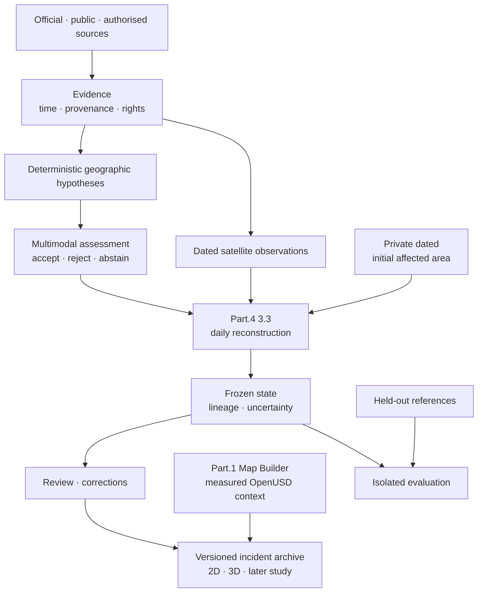

# FireViewer

**Open-source tools to preserve, reconstruct and study wildfire events.**

FireViewer started during the wildfire in Die, France, the town where I grew
up and where part of my family still lives.

At the time I was mainly trying to understand what was happening from scattered
official information, maps, images, videos and geographic data.

The project grew from there.

What started as a way to make sense of one event gradually became an attempt to
answer a more difficult question:

**Can we preserve a wildfire well enough that it can be reopened, checked and
studied later instead of being reduced to a final map?**

Today FireViewer combines evidence collection, computer vision, satellite
observations, deterministic geographic processing, daily fire-state
reconstruction and reproducible OpenUSD environments.

Its main rule is simple:

> **observed ≠ reconstructed ≠ simulated ≠ predicted**

A useful reconstruction does not become an observation just because it looks
convincing.

A model output is not automatically evidence.

And when the available information is not sufficient, `unknown` or `abstain`
is a better result than invented precision.

> FireViewer is not an emergency alert service, an official wildfire source,
> an incident-command system or a certified fire-spread predictor.

## How the pieces fit together

The separation is intentional.

Evaluation references do not feed reconstruction.

Measured maps do not become reconstructed wildfire state.

Synthetic scenes do not become evidence of real events.

## What exists today

FireViewer is still a research MVP, but a substantial technical foundation
already exists:

- bounded evidence acquisition and provenance;
- image and video processing;
- deterministic geographic hypotheses;
- satellite evidence from several source families;
- structured multimodal assessment with explicit abstention;
- Part.4 3.3 daily reconstruction;
- versioned probability, provenance and spatial artifacts;
- reproducible measured-map production;
- OpenUSD and web-view spatial packages;
- synthetic-data tooling kept separate from real evidence;
- public models, datasets and measured-map resources.

The complete real-data path is **not yet qualified as an unattended production
service**, and the current Part.4 profile remains uncalibrated.

That distinction matters: code existing and something being proven to work
reliably in the real world are not the same thing.

## Part.4 3.3

The current reconstruction line starts from a private, dated estimate of the
initially affected area.

That initial contour does **not** mean the whole area is active.

Later admissible observations contribute to daily versions of:

- `affected`
- `active`
- `observable`
- uncertainty

The system keeps probability state, source lineage and revisions instead of
silently rebuilding history from the latest geometry.

A correction creates another revision. It does not erase the previous one.

Historical reconstruction also respects time: a satellite product available
today is not automatically considered information that was available at the
historical date being reconstructed.

More details:

- [Architecture](https://github.com/fireviewer/Fireviewer_doc/blob/main/docs/public/ARCHITECTURE.md)
- [Daily reconstruction](https://github.com/fireviewer/Fireviewer_doc/blob/main/docs/public/RECONSTRUCTION.md)
- [Current status](https://github.com/fireviewer/Fireviewer_doc/blob/main/docs/public/STATUS.md)

## Measured maps and OpenUSD

The Map Builder is a separate part of FireViewer.

It creates measured geographic environments and portable OpenUSD packages from
versioned geographic inputs.

These environments provide spatial context in which an incident can later be
explored or studied.

They are not generated wildfire boundaries.

The portable map contracts live in
[`fireviewer-spatial`](https://github.com/fireviewer/fireviewer-spatial). The
source-only [`fireviewer-unreal`](https://github.com/fireviewer/fireviewer-unreal)
project provides an Unreal Engine consumer for those contracts. Its Git tree
does not contain datasets, model weights, imported asset libraries, generated
maps or reproduction outputs; one invented JSON/GeoJSON incident fixture is
kept only to document and test the configuration contract.

The Unreal source path is not a claim that a packaged build, cloud worker or
visual result has been accepted in production.

The environmental asset library is also still relatively small. Improving its
quality, diversity and reproducibility is one of the next important steps for
FireViewer.

## Models and datasets

FireViewer publishes research models, datasets, measured maps and
reproducibility material through:

**https://huggingface.co/fireviewer**

Resources can have different states: active, research, restricted, legacy or
superseded.

Limitations and failed assumptions are useful information too; not every
experiment needs to be presented as a successful production model.

## Contributing

FireViewer is currently mostly maintained by me, and there is no large
community behind it yet.

That is fine.

Useful contributions do not need to be large.

Finding a broken OpenUSD package, checking a geographic assumption, testing a
dataset, improving accessibility, reproducing a bug, correcting documentation
or showing that one of my approaches is wrong can all help.

See:

- [Contributing](https://github.com/fireviewer/.github/blob/main/CONTRIBUTING.md)
- [Governance](https://github.com/fireviewer/Fireviewer_doc/blob/main/GOVERNANCE.md)
- [Code of Conduct](https://github.com/fireviewer/.github/blob/main/CODE_OF_CONDUCT.md)
- [Security](https://github.com/fireviewer/.github/blob/main/SECURITY.md)
- [Support](https://github.com/fireviewer/.github/blob/main/SUPPORT.md)

## Governance

For now, technical governance is deliberately simple and maintainer-led.

A French non-profit association is being created to give FireViewer a proper
administrative and financial structure.

The association is meant to help the project survive and grow — not to create
an artificial layer of technical authority above the people actually working
on it.

The governance should reflect the project that actually exists, not imitate the
governance of a much larger project we do not have yet.

## Support and collaboration

FireViewer has so far been developed with limited financial resources and a
large amount of personal time.

Infrastructure credits, compute, storage, reusable data, technical help,
scientific review, OpenUSD/geospatial expertise, grants and other forms of
support can all be useful.

Support does not buy influence over evidence, uncertainty or technical
results.

For research, infrastructure, collaboration, rights, provenance or security:

**unicornwhodev@gmail.com**
